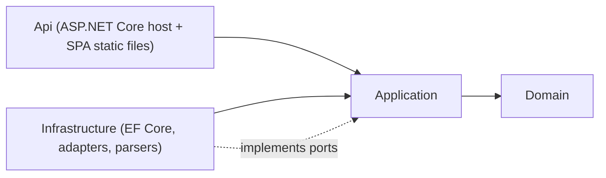
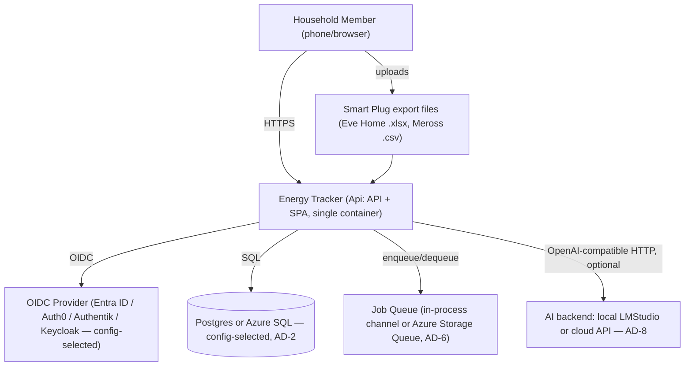
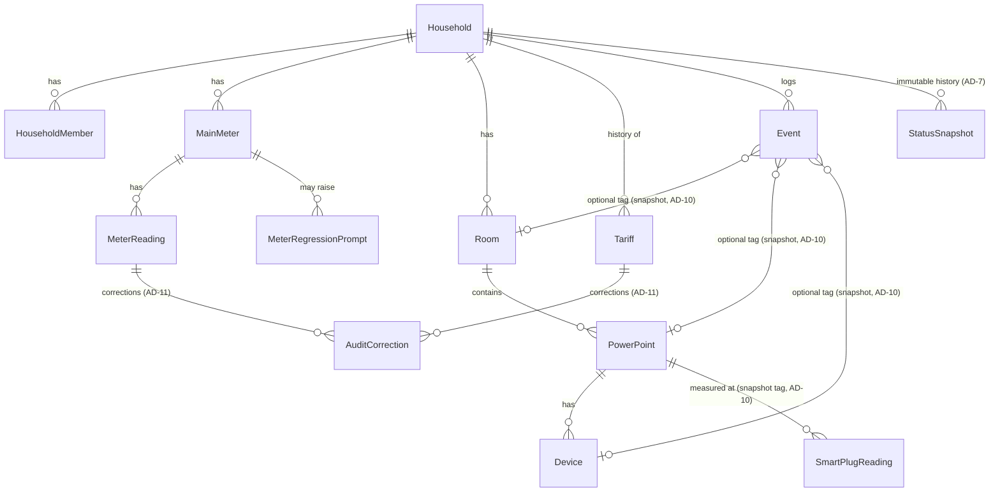
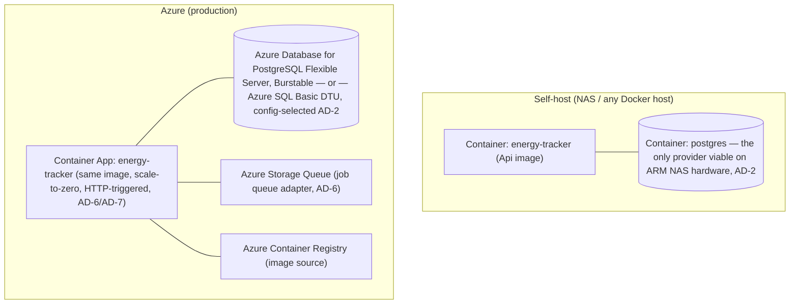

# Architecture Spine — Energy Tracker v2

## Design Paradigm

**Ports & Adapters (Hexagonal).** The PRD independently demands the same shape four times over — OIDC provider swappable via config, AI backend swappable (local vs cloud), a job-processing mechanism the user wants abstracted behind pluggable implementations, and (by this architecture's own decision) the database provider swappable between self-host and cloud. Naming Ports & Adapters as the paradigm turns four one-off escape hatches into one rule, applied consistently.

Three layers, dependencies point inward only:

- **Domain** — entities, value objects, and the calculation engine (Pattern Detective baseline math, Bonus-Decay Normalization). Pure C#. No reference to EF Core, ASP.NET Core, Azure SDKs, or any adapter.
- **Application** — use cases and the port interfaces adapters implement (`IBackgroundJobQueue`, `IAiPlausibilityClient`, `ISmartPlugParser`, repository ports). Depends only on Domain.
- **Infrastructure & Api** — EF Core + both DB providers, queue adapters, AI adapter, file parsers, ASP.NET Core host, static SPA hosting. Depends on Application and Domain; nothing depends on it.



## Invariants & Rules

### AD-1 — Ports & Adapters dependency direction

- **Binds:** all
- **Prevents:** Domain or Application code taking a compile-time dependency on EF Core, a specific cloud SDK, or a specific OIDC/AI vendor — the exact drift that would make swapping any of them require touching core logic instead of adding an adapter.
- **Rule:** Domain has zero external package references beyond the BCL. Application defines interfaces only; it never references `Infrastructure` or `Api`. All framework/vendor packages live in `Infrastructure`/`Api`.

### AD-2 — Dual database-provider persistence shape

- **Binds:** all persistence (FR-1–FR-28 data)
- **Prevents:** the two providers drifting into different schemas, or a feature landing that only works against one of them.
- **Rule:** One shared `EnergyTrackerDbContext` (never a per-provider subclass). Two migrations-only projects, `Infrastructure.Migrations.Postgres` and `Infrastructure.Migrations.SqlServer`, each wired via `.MigrationsAssembly(...)`. Provider is chosen once, at the composition root, from a single `Database:Provider` config value (`Postgres` | `SqlServer`) — never branched on elsewhere. A migration is added to both projects in the same commit via `scripts/add-migration.sh <Name>`, never to one alone. Portable subset only: plain relational columns (`string`, `int`, `decimal`, `DateTimeOffset`, `bool`, `byte[]`), standard LINQ translated identically by both providers. No LINQ query, raw SQL fragment, or column mapping may rely on a provider-specific feature — explicitly banned: Postgres `jsonb`/`ILike` operators, SQL Server `rowversion`, Postgres `xmin`, JSON-typed columns for anything queryable (see AD-4 for the portable alternative to native row-versioning).
- **[ADOPTED]** User explicitly chose dual-provider support (Postgres, Azure SQL Basic DTU) over a single engine, accepting the added migration-maintenance cost for near-zero Azure cost and self-host ARM compatibility. Provider is a config choice, not a strict environment lock — but SQL Server's Linux container image is x86-only, so self-hosting it on an ARM NAS (common consumer hardware, e.g. Synology/QNAP) isn't viable; Postgres runs on both architectures and is the only provider that works everywhere. Azure can run either provider.

### AD-3 — Data-layer tenant isolation

- **Binds:** all Household-scoped entities, including background job processing (AD-6)
- **Prevents:** a query handler forgetting to filter by Household and leaking one household's data into another's view — the PRD requires this enforced below the UI, not by convention in each handler. Also prevents the specific bypass where a job processor, having no HTTP principal to resolve `ICurrentHouseholdAccessor` from, reaches for `IgnoreQueryFilters()` or a raw/`Find()`-style lookup as the obvious workaround — silently reopening the exact leak this AD exists to close.
- **Rule:** Every Household-scoped entity carries `HouseholdId`. `EnergyTrackerDbContext.OnModelCreating` applies a global query filter (`HasQueryFilter(e => e.HouseholdId == _currentHousehold.Id)`) for each of them, sourced from `ICurrentHouseholdAccessor`. No repository or handler applies its own household filter — the DbContext is the single enforcement point. `DbSet<T>.Find()`, `FromSqlRaw`, and `.IgnoreQueryFilters()` are never used against a Household-scoped entity. `ICurrentHouseholdAccessor` has two resolution paths only: from the authenticated principal (HTTP requests) or from the enqueued job's `HouseholdId` field (AD-6 job processing, set before any query executes) — no code path is exempt from having one of these two set.

### AD-4 — Optimistic concurrency via portable version column

- **Binds:** Meter Reading, Tariff, Household settings (FR-1, FR-10, FR-2) — anywhere concurrent edits are plausible per the PRD's "no silent lost update" NFR
- **Prevents:** two concurrent edits silently overwriting each other, and (per AD-2) reliance on a provider-specific concurrency mechanism (SQL Server `rowversion`, Postgres `xmin`) that would fork behavior between providers.
- **Rule:** Each concurrency-sensitive entity carries a plain `int Version` column, mapped as an EF Core concurrency token, incremented on every update. A conflicting write throws `DbUpdateConcurrencyException`, mapped to an HTTP 409; the client reloads and retries. Never last-write-wins, never a silent merge.

### AD-5 — Shared Bonus-Decay Normalization module

- **Binds:** Pattern Detective (pace threshold), Tariff Savings Radar (FR-12–FR-14)
- **Prevents:** the two features' savings/threshold math diverging over time (FR-14's explicit requirement).
- **Rule:** Bonus-Decay Normalization lives in exactly one place — `Domain.Calculations.BonusDecayNormalizer`, a pure function of (rate, bonus terms, elapsed time) — called by both features. Neither feature may reimplement or locally adjust the formula.

### AD-6 — Async job processing shape

- **Binds:** FR-4 (Smart Plug import), any future Tier-3 async work
- **Prevents:** self-host needing an extra broker container it doesn't need yet, the cloud/self-host paths requiring different application code, and a push-based completion signal that fights scale-to-zero.
- **Rule:** One `IBackgroundJobQueue` port, generic over a single pinned envelope shape — `JobEnvelope<TPayload> { JobId, HouseholdId, JobType, PayloadJson }` — never a delegate/closure-based executor (a delegate can't serialize across the Azure Storage Queue adapter, so it would work on one adapter and silently fail on the other). `TPayload` is always a plain JSON-serializable record; `HouseholdId` on the envelope is what AD-3's job-processing path resolves `ICurrentHouseholdAccessor` from. Two adapters: `InProcessChannelJobQueue` (default; `System.Threading.Channels`-backed, runs inside the same ASP.NET Core process via a hosted `BackgroundService` — zero extra containers, used for self-host and local dev) and `AzureStorageQueueJobQueue` (cloud). Selected the same way as AD-2's provider (one config value, composition root). The API and the worker are **one process, one container** in both environments — no separate worker deployment exists yet (see Deferred). The client learns a job finished by **polling** a `GET /api/jobs/{id}` status endpoint, never via WebSocket/SSE — a persistent push connection would either prevent scale-to-zero from ever triggering or break outright on a cold start.

### AD-7 — Current Status/Reminder are computed at request time; history is persisted at computation time

- **Binds:** FR-6, FR-7, FR-8, FR-15
- **Prevents:** a naive recurring-timer implementation that silently stops firing once the Azure Container App scales to zero (`IHostedService`/`Timer`-based cron does not survive scale-to-zero, and the failure would be invisible until a household missed a reminder) — **and**, separately, a builder taking "compute live" to mean *history* is also recomputed live, which would silently rewrite past Status/pace whenever the Yearly Baseline or threshold changes, violating the PRD's explicit no-retroactive-rewrite requirement (FR-2, FR-8).
- **Rule:** The **current** Status (FR-6/FR-7) and Tariff Check Reminder due-ness (FR-15) are pure, synchronous computations evaluated on every relevant read — never precomputed by a background schedule. Separately, every time Status is (re)computed — on a new Meter Reading or a completed Smart Plug import, per FR-6 — the result is also written to an immutable `StatusSnapshot` row. **Exactly one** application service, `IStatusRecomputeService`, owns this write; the Meter-Reading-create handler and the Smart-Plug-import-completion handler both call into it rather than each building its own snapshot writer (a second, independently-built writer is exactly the kind of divergence this spine exists to prevent — see the Capability Map, where Smart Plug Import is bound to this AD for that reason). FR-8's Trend History view reads persisted `StatusSnapshot` rows, never a live recomputation against current settings, so a later Yearly Baseline/threshold edit cannot rewrite history. FR-18's proactive weekly recap (deferred, post-MVP) is the one feature that genuinely needs an externally-triggered wake-up; when it's built, it must use an externally-triggered scheduler (Azure Container Apps scheduled Jobs, or a KEDA cron scale rule), never an in-process timer.

### AD-8 — AI Wattage Plausibility as one config-selected adapter

- **Binds:** FR-17
- **Prevents:** building two separate adapter implementations (local vs cloud) when one suffices, and the feature becoming a hard dependency it's explicitly not allowed to be.
- **Rule:** One `IAiPlausibilityClient` port, one adapter (`OpenAiCompatibleClient`) speaking the OpenAI-compatible chat/completions HTTP shape — LMStudio and essentially every cloud LLM provider implement this shape, so the "local vs cloud" choice is just a base-URL + API-key config pair, not two code paths. When unset, the port resolves to a no-op implementation and FR-17 correlation is simply absent from the response — the rest of the product must not branch on whether AI is enabled.

### AD-9 — Smart-plug import parser port

- **Binds:** FR-4, FR-24
- **Prevents:** vendor-specific parsing logic leaking into the import pipeline or the domain layer.
- **Rule:** One `ISmartPlugParser` port; one adapter per vendor format (`EveHomeXlsxParser`, `MerossCsvParser`), each producing a common `SmartPlugReading` shape. Eve Home timestamps are parsed as local time, never UTC-converted (addendum's documented behavior, reproduced deliberately). Meross device identity comes from the documented filename pattern, not file-body metadata. FR-20's generic column-mapping is explicitly **not** built against this port yet — see Deferred.

### AD-10 — Historical tag integrity for Room / Power Point / Device

- **Binds:** FR-9, FR-16, FR-28
- **Prevents:** two independently-built features (Smart Plug import view, Event logging) choosing different answers to "what happens to old data when the tag is deleted or reassigned" — one might cascade-delete, another might silently follow a retag.
- **Rule:** Room, Power Point, and Device are **soft-deleted** (`ArchivedAt`, never a hard delete) — historical foreign keys stay valid and the UI can offer reassignment. In addition, `SmartPlugReading` and `Event` snapshot the Room/PowerPoint/Device identity **by value** at write time (denormalized display fields), because a Power Point's live Room assignment can change later — a live FK-join would incorrectly rewrite history to reflect the new assignment. FR-9/FR-16's "stays attributed to the tag active at the time" is satisfied by the snapshot, not by the FK.

### AD-11 — Shared audit-correction mechanism

- **Binds:** Meter Reading edits, Tariff edits (Cross-Cutting NFR: audit trail on corrections)
- **Prevents:** each editable entity growing its own bespoke "keep the old value" pattern.
- **Rule:** One `AuditCorrection` table (`EntityType`, `EntityId`, `FieldName`, `OldValue`, `NewValue`, `CorrectedAtUtc`) and one `IAuditCorrectionRecorder` service, called from both Meter Reading and Tariff update paths. No entity-specific "PreviousValue" column duplicated per table. **Out of scope by construction, not by oversight:** FR-23's full-dataset restore is a wholesale replace with no partial-merge mode (PRD FR-23 consequence) — it is not an "edit" of an existing row and does not go through `IAuditCorrectionRecorder`. Any future import path that *does* merge into existing data must route through this AD's mechanism; a wholesale restore never does.

### AD-12 — Meter Reading regression queue

- **Binds:** FR-25
- **Prevents:** a second regression arriving mid-classification from racing the first, or entry-order being mistaken for chronological order.
- **Rule:** At most one **open** `MeterRegressionPrompt` per Main Meter at a time. Prompts are ordered by the reading's timestamp, not its creation/entry order. An open prompt excludes its triggering Reading (and everything chronologically after it) from FR-3's baseline computation until resolved as *reset* or *rollover*.

### AD-13 — Single-artifact deployment: backend serves the SPA

- **Binds:** all (deployment)
- **Prevents:** self-host and cloud needing structurally different deployment topologies, which would violate the PRD's explicit "one deployment artifact" NFR.
- **Rule:** The `Api` project serves the built React/shadcn SPA's static assets directly (ASP.NET Core SPA-hosting pattern) from the same container as the API. **This deviates from, and supersedes, the PRD addendum's candidate shape** (Azure Static Web App + separate Container App) — that split has no self-host equivalent, and (reconfirmed 2026-08-09) costs a guaranteed extra $9/month on Azure for capability this project's traffic doesn't need. Addendum updated to match.

### AD-14 — Main Meter is the sole authoritative total

- **Binds:** Pattern Detective (FR-5, FR-9), Data Export/Import
- **Prevents:** rebuilding v1's core failure — a Residual/attribution figure that looks precise enough to trust and isn't. This is the brief's single named non-negotiable invariant; the spine must protect it structurally, not just by naming it.
- **Rule:** `MeterReading` is the only entity representing authoritative total consumption. This binds the **whole system, not just Domain/Application** — no domain code, application service, API response DTO, or frontend view sums `SmartPlugReading` or `Event` data into a figure that is compared against, reconciled with, or rendered alongside the Main Meter total as if checking it (e.g. no chart puts a summed-measured-total series on the same axis as Meter-derived pace). `SmartPlugReading` and `Event` data may only ever be surfaced as context/signal (FR-5, FR-9's "measured context, not a reconciled breakdown") — there is no `Residual` type, field, DTO property, or view anywhere in the system, backend or frontend.

### AD-15 — Generic by default: no hardcoded household-specific values

- **Binds:** all (Household & Access, Pattern Detective, Tariff Radar)
- **Prevents:** the product quietly becoming single-household-shaped — the brief's secondary-audience requirement (other self-hosters run it unforked) has real architectural teeth: a hardcoded default anywhere is a fork waiting to happen.
- **Rule:** Every household-specific value (Yearly Baseline presets, trending threshold default, currency, Locale) is a `Household`-scoped config row, never a literal in code. Presets (e.g. FR-2's 1p/2p/3p/4p kWh figures) are offered as suggested starting values in the UI, never silently applied as defaults a household didn't choose.

### AD-16 — Offline-safe, idempotent Meter Reading writes

- **Binds:** FR-1 (offline capture NFR)
- **Prevents:** a double-inserted reading when a flaky-signal sync retries after losing its acknowledgment, and — the opposite failure — naive dedup logic that incorrectly collapses a legitimate second same-day reading with a different timestamp (FR-1 explicitly requires both to be possible).
- **Rule:** Meter Reading creation carries a client-generated idempotency key (GUID) set at the moment of entry, before any network attempt. The frontend queues unsent readings locally (IndexedDB) while offline and flushes on reconnect. The API upserts by idempotency key: a retried request with the same key is a no-op against an already-recorded reading; a new key is always a new reading, even at an identical or near-identical timestamp.

### AD-17 — Session persistence via server-side cookie, not client-stored tokens

- **Binds:** Household & Access (FR-26–FR-28), UJ-1's "stays logged in on their phone"
- **Prevents:** two independently-built areas choosing different auth-persistence strategies (e.g. one storing a token in `localStorage`, another assuming a cookie) — and the XSS token-theft exposure that comes with client-side token storage. Also prevents the specific scale-to-zero failure where ASP.NET Core's Data Protection key ring regenerates on every cold start, silently invalidating every existing session cookie the moment the Container App scales back up — which would defeat this AD's entire purpose without ever throwing a visible error.
- **Rule:** Authentication uses ASP.NET Core's cookie authentication handler chained to the OIDC handler — the browser holds an httpOnly session cookie, not a token the SPA can read or store itself. Data Protection keys are persisted externally via `PersistKeysToDbContext` against the same `EnergyTrackerDbContext` (portable across both AD-2 providers, no extra infra) — never left to the in-memory default, which does not survive a scale-to-zero cold start. This is what makes "stays logged in on their phone" durable across both app restarts and Azure scale-to-zero cycles.

### AD-18 — i18n: Locale drives both storage-neutral formatting and additive translation

- **Binds:** all UI-facing text and number/date formatting; SM-5 (external adoption)
- **Prevents:** adding a new launch Locale (beyond de-DE/en-US) requiring a code change, and display-formatting logic scattering across features instead of keying off one field.
- **Rule:** `Household.Locale` is the single field driving both number/date display formatting and UI language. Underlying data stays locale-neutral in storage (per the Consistency Conventions table) regardless of `Locale`. Frontend translations live in additive resource files (e.g. an i18next-style catalog); any backend-rendered strings (e.g. future email/notification copy) use .NET's built-in `IStringLocalizer`/`.resx` mechanism. A new Locale is a resource-file addition, never a code change.

### AD-19 — Operational baseline: health, logs, secrets

- **Binds:** all (deployment/operations — an envelope this altitude owns and must not leave silent)
- **Prevents:** self-host and Azure needing different operational tooling, and secrets ending up in source control or baked into the image.
- **Rule:** The `Api` exposes a `/health` endpoint (liveness only — no DB/dependency check, so a slow Postgres/Azure SQL doesn't fail Container Apps' probe and cause a restart loop). Logging is structured (Serilog or equivalent) to stdout/stderr only — self-host reads it via `docker logs`, Azure wires the same stream to Log Analytics; no code-level branching on environment for logging. All secrets (DB connection string, OIDC client secret, AI API key) are supplied via environment variables / Container Apps secrets / a self-host `.env` file — never committed, never baked into the image.
- **Known local-vs-Azure behavior deltas:** local dev/self-host and Azure structurally diverge in ways that only surface on a live Azure deployment (no reverse proxy locally vs. Container Apps' TLS-terminating ingress, no ACR/managed-identity concept locally vs. a real credential-timing race on a fresh deploy, no region concept locally vs. Postgres's per-region provisioning restrictions, blank-env-var-is-fine locally vs. ACA rejecting an empty `secrets` value). Documented in full, with the story/incident each one traces back to, in `docs/local-vs-azure-deltas.md` — check it at definition time for any story touching auth, ingress, the database provider, or the deploy pipeline.

## Consistency Conventions

| Concern | Convention |
| --- | --- |
| Naming | Entities/DTOs: PascalCase C#, singular (`MeterReading`, not `MeterReadings`). API routes: kebab-case plural nouns (`/api/meter-readings`). Ports: `I{Capability}` in `Application/Ports`; adapters: `{Vendor}{Capability}` in `Infrastructure/Adapters`. |
| Config-driven adapter selection | Every swappable capability (DB provider, job queue, AI backend, OIDC) is selected by exactly one config value read once at the composition root (`Program.cs`). No feature code branches on environment or provider elsewhere. |
| Data & formats | All timestamps: `DateTimeOffset`, ISO 8601 with explicit offset on the wire. All money: `decimal`, never `double`/`float`. Currency: ISO 4217 code stored per Tariff entry. Background/scheduled work (what little exists per AD-7) runs in UTC regardless of display Locale. |
| Errors | API errors are RFC 7807 `ProblemDetails`. Concurrency conflicts (AD-4) return 409 with the current server state so the client can reconcile. |
| State & cross-cutting | Every route requires authentication except the OIDC callback (NFR). Tenant scoping is DbContext-level only (AD-3) — no per-handler filtering. Soft-delete, never hard-delete, for Room/PowerPoint/Device (AD-10). |
| Migrations | `scripts/add-migration.sh <Name>` adds a migration to both provider projects atomically — a migration is never added to just one (AD-2). |
| API surface shape | The Dashboard Status endpoint returns only the current Status value and its one headline/supporting sentence (FR-7) — drill-down data (Trend History, per-plug view) is always a separate endpoint, never merged into the Status response. Structural guard for the brief's "says less, on purpose" discipline: growth pressure lands on drill-down endpoints, not the one surface the product is judged by. |
| Async job status | Clients learn a background job (Smart Plug import) finished by polling `GET /api/jobs/{id}`, never via WebSocket/SSE (AD-6). |
| Auth persistence | Server-side httpOnly session cookie via ASP.NET Core cookie auth chained to OIDC (AD-17) — the SPA never reads or stores a token itself. |

## Stack

| Name | Version |
| --- | --- |
| .NET | 10 (LTS, supported to Nov 2028) |
| ASP.NET Core | 10 — Minimal APIs |
| EF Core | 10 |
| Npgsql.EntityFrameworkCore.PostgreSQL | 10.0.3 |
| Microsoft.EntityFrameworkCore.SqlServer | 10.x (matching EF Core 10) |
| PostgreSQL (self-host) | 17.x |
| Azure SQL Database (cloud) | Basic tier, DTU purchasing model (~5 DTU, ~$5/mo flat — no auto-pause/scale-to-zero; the DTU model has no serverless tier, unlike Postgres Flexible Server's Burstable stop/start. User's explicit choice, accepted knowingly: cheap and simple beats elastic here.) |
| React | 19.x |
| Vite | 8.x |
| shadcn/ui + Tailwind CSS | v4 (per DESIGN.md) |
| Frontend i18n library | i18next (or equivalent additive-catalog library) — AD-18 |
| Frontend offline queue | IndexedDB-backed local write queue + service worker (background sync on reconnect) for Meter Reading **creation** (FR-1's offline NFR is scoped to entry, not edits — AD-16) |
| Docker / Docker Compose | current stable |
| Azure Container Apps | — (production host) |
| Azure Storage Queue | — (cloud job-queue adapter, AD-6) |

## Structural Seed

```text
energy-tracker-v2/
  src/
    EnergyTracker.Domain/            # entities, value objects, Domain.Calculations (baseline math, Bonus-Decay Normalizer) — no external deps
    EnergyTracker.Application/       # use cases, ports (IBackgroundJobQueue, IAiPlausibilityClient, ISmartPlugParser, ICurrentHouseholdAccessor, repository interfaces)
    EnergyTracker.Infrastructure/    # EnergyTrackerDbContext, EF Core config, adapters (Postgres/SqlServer providers wired here, InProcessChannelJobQueue, AzureStorageQueueJobQueue, OpenAiCompatibleClient, EveHomeXlsxParser, MerossCsvParser)
    EnergyTracker.Infrastructure.Migrations.Postgres/    # migrations-only project (AD-2)
    EnergyTracker.Infrastructure.Migrations.SqlServer/   # migrations-only project (AD-2)
    EnergyTracker.Api/               # ASP.NET Core Minimal API host, composition root (Program.cs), serves built SPA from wwwroot/
  web/                                # React + Vite + shadcn/ui + Tailwind source; builds into EnergyTracker.Api/wwwroot
                                      # includes: service worker + IndexedDB offline queue for Meter Reading creation (AD-16), i18next locale catalogs (AD-18)
  scripts/
    add-migration.sh                 # adds a migration to both provider projects together (AD-2)
  docker-compose.yml                 # local dev: api + postgres (default provider)
  docker-compose.sqlserver.yml       # optional profile: swap in sqlserver to test that path locally
  Dockerfile                         # multi-stage: build web/ -> build .NET -> runtime image (single artifact, AD-13)
```

### Context



### Core Entities (ERD)



### Deployment & Environments



Both environments run the **same container image** (AD-13); only configuration differs (DB provider, job queue adapter, OIDC issuer, AI backend endpoint). Local dev uses `docker-compose.yml` (api + postgres), which doubles as the self-host reference deployment.

## Capability → Architecture Map

| Capability / Area | Lives in | Governed by |
| --- | --- | --- |
| Pattern Detective (FR-1–FR-9, FR-24–FR-25) | `Domain.Calculations` (baseline math), `Application` use cases, `Api` endpoints | AD-1, AD-4, AD-5, AD-7, AD-10, AD-11, AD-12, AD-14, AD-16 |
| Tariff Savings Radar (FR-10–FR-15) | `Domain.Calculations.BonusDecayNormalizer` (shared with Pattern Detective), `Application`, `Api` | AD-5, AD-4, AD-7, AD-11 |
| Context Capture (FR-16–FR-18) | `Application`, `Infrastructure.Adapters.OpenAiCompatibleClient` | AD-8, AD-10, AD-14 |
| Extensible Platform (FR-19–FR-21) | `Application.Ports` (`ISmartPlugParser` today; event-rule and threshold ports Deferred) | AD-9, AD-15, Deferred |
| Data Export/Import (FR-22–FR-23) | `Application` use case over all repositories | AD-2, AD-3 |
| Household & Access (FR-26–FR-28) | `Infrastructure` (OIDC handler), `Application.ICurrentHouseholdAccessor` | AD-3, AD-10, AD-15, AD-17, Consistency Conventions (auth) |
| Smart Plug Import (FR-4, FR-24) | `Infrastructure.Adapters` parsers, `IBackgroundJobQueue` | AD-6, AD-9, AD-7 (StatusSnapshot trigger), AD-3 (job-context isolation) |
| i18n / Locale (SM-5) | `Household.Locale`, frontend catalogs, backend `IStringLocalizer` | AD-18, AD-15 |
| Operations (deployment envelope) | `/health` endpoint, structured logging, env-based secrets | AD-19 |

## Deferred

- **FR-20 generic Smart-Plug column mapping.** PRD itself flags this as low-confidence (Open Question 1). `ISmartPlugParser` (AD-9) leaves the seam open, but no generic/config-driven mapper is designed or built yet — revisit after a feasibility spike against real-world export variance.
- **FR-19 custom event/plausibility rules.** No rule format or evaluation engine designed yet. Whatever's built must stay behind a port consistent with AD-1, not a bespoke scripting layer.
- **FR-21 broader tunable thresholds** beyond the single FR-6 trending threshold. No settings-surface design yet.
- **FR-18 proactive weekly recap.** Needs a real externally-triggered scheduler per AD-7 (Container Apps scheduled Jobs or a KEDA cron rule) plus a decided notification delivery channel (PRD Open Question 2) — neither is designed yet.
- **Worker/API process split.** AD-6 currently runs API and job processing in one process/container. If Smart Plug import volume or AI-correlation load ever justifies independent scaling, split the worker into its own Container App with a queue-depth KEDA rule — same image, different entrypoint/command. Not needed at current expected household-scale volume.
- **Local OIDC provider for dev/test.** Docker Compose currently expects a real OIDC issuer (Entra ID/Auth0/etc.) even in local dev. Whether to bundle a lightweight local OIDC container (e.g. for offline dev) is left open — not blocking, since self-hosters typically already run one.
- **Multi-Main-Meter UI/logic.** The data model allows more than one Main Meter per Household (PRD Glossary), but v2's Pattern Detective and dashboard operate on a single Main Meter per Household — multi-meter flows are explicitly out of scope for v2, not designed here.
- **Storage growth on Azure SQL Basic (2 GB cap).** Fine for relational rows (readings, tariffs, events) at personal-household scale; dense Smart Plug interval data over many years could approach it. Not a concern at MVP scale — revisit if a household's import history grows large enough to matter.
