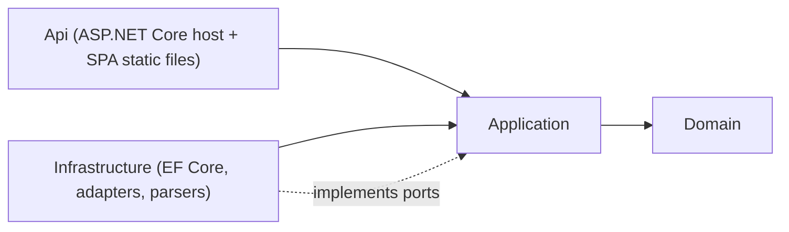

# Design Paradigm

**Ports & Adapters (Hexagonal).** The PRD independently demands the same shape four times over — OIDC provider swappable via config, AI backend swappable (local vs cloud), a job-processing mechanism the user wants abstracted behind pluggable implementations, and (by this architecture's own decision) the database provider swappable between self-host and cloud. Naming Ports & Adapters as the paradigm turns four one-off escape hatches into one rule, applied consistently.

Three layers, dependencies point inward only:

- **Domain** — entities, value objects, and the calculation engine (Pattern Detective baseline math, Bonus-Decay Normalization). Pure C#. No reference to EF Core, ASP.NET Core, Azure SDKs, or any adapter.
- **Application** — use cases and the port interfaces adapters implement (`IBackgroundJobQueue`, `IAiPlausibilityClient`, `ISmartPlugParser`, repository ports). Depends only on Domain.
- **Infrastructure & Api** — EF Core + both DB providers, queue adapters, AI adapter, file parsers, ASP.NET Core host, static SPA hosting. Depends on Application and Domain; nothing depends on it.

