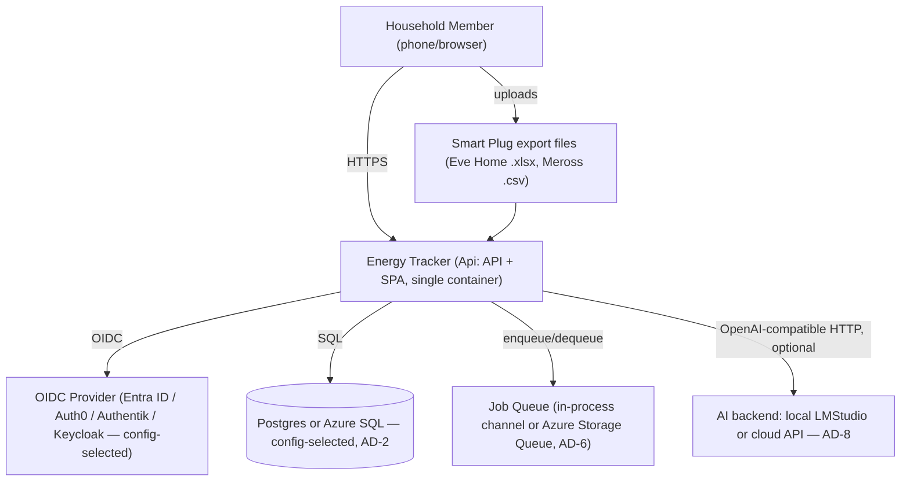
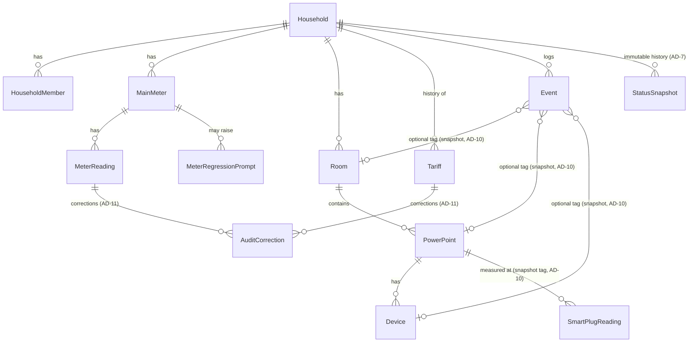
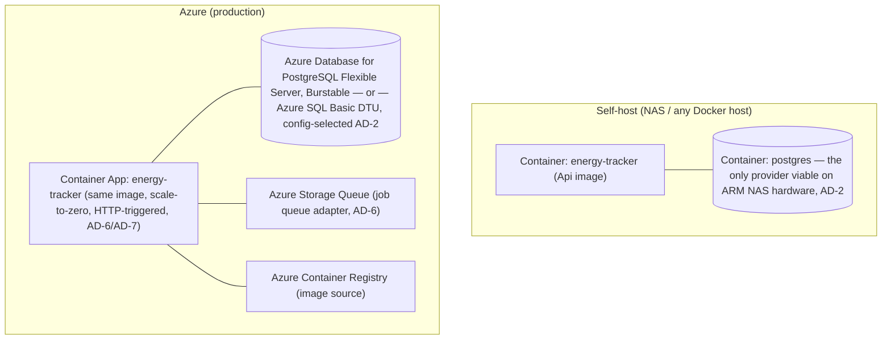

# Structural Seed

```text
energy-tracker-v2/
  src/
    EnergyTracker.Domain/            # entities, value objects, Domain.Calculations (baseline math, Bonus-Decay Normalizer) — no external deps
    EnergyTracker.Application/       # use cases, ports (IBackgroundJobQueue, IAiPlausibilityClient, ISmartPlugParser, ICurrentHouseholdAccessor, repository interfaces)
    EnergyTracker.Infrastructure/    # EnergyTrackerDbContext, EF Core config, adapters (Postgres/SqlServer providers wired here, InProcessChannelJobQueue, AzureStorageQueueJobQueue, OpenAiCompatibleClient, EveHomeXlsxParser, MerossCsvParser)
    EnergyTracker.Infrastructure.Migrations.Postgres/    # migrations-only project (AD-2)
    EnergyTracker.Infrastructure.Migrations.SqlServer/   # migrations-only project (AD-2)
    EnergyTracker.Api/               # ASP.NET Core Minimal API host, composition root (Program.cs), serves built SPA from wwwroot/
  web/                                # React + Vite + shadcn/ui + Tailwind source; builds into EnergyTracker.Api/wwwroot
                                      # includes: service worker + IndexedDB offline queue for Meter Reading creation (AD-16), i18next locale catalogs (AD-18)
  scripts/
    add-migration.sh                 # adds a migration to both provider projects together (AD-2)
  docker-compose.yml                 # local dev: api + postgres (default provider)
  docker-compose.sqlserver.yml       # optional profile: swap in sqlserver to test that path locally
  Dockerfile                         # multi-stage: build web/ -> build .NET -> runtime image (single artifact, AD-13)
```

## Context



## Core Entities (ERD)



## Deployment & Environments



Both environments run the **same container image** (AD-13); only configuration differs (DB provider, job queue adapter, OIDC issuer, AI backend endpoint). Local dev uses `docker-compose.yml` (api + postgres), which doubles as the self-host reference deployment.
